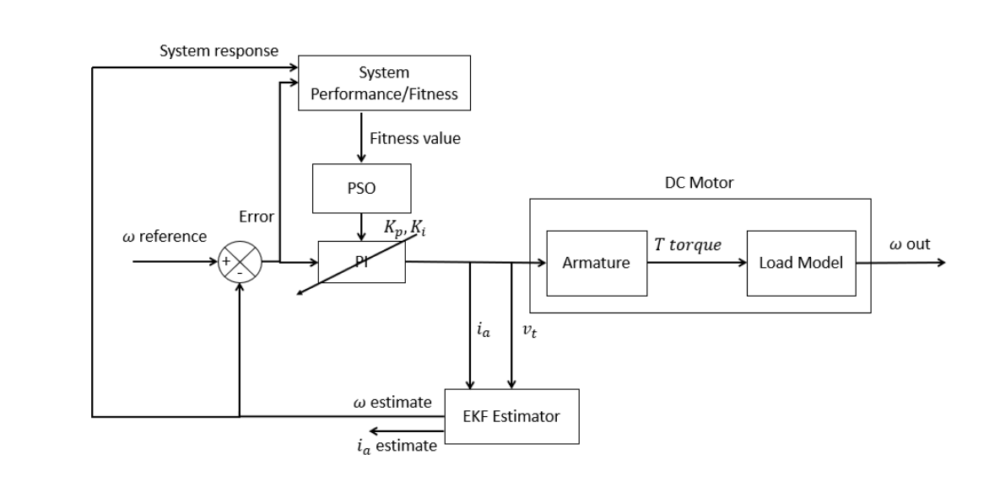
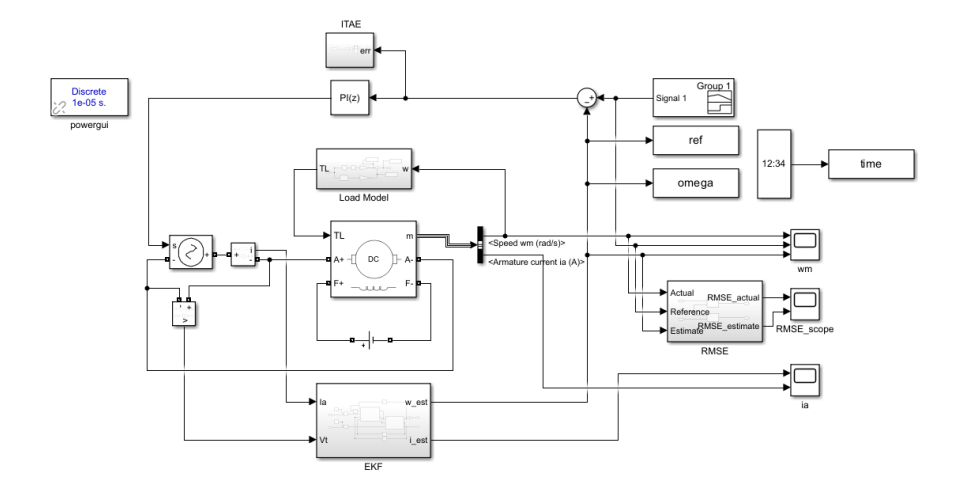
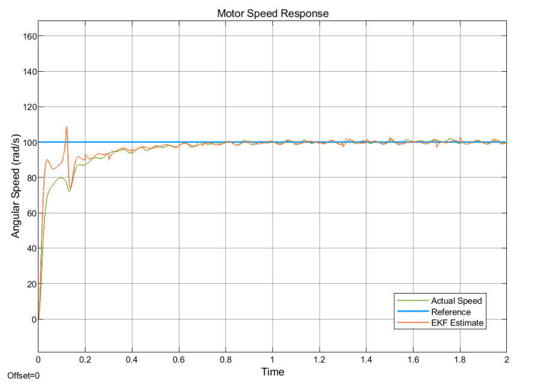
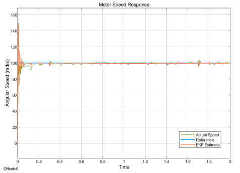

# Speed Control of DC Motor using Extended Kalman Filter (EKF) and Particle Swarm Optimization (PSO) based PI-Controller.

### Block Diagram

In this program the angular speed of the DC motor is controlled using a PI-Controller, where the parameters are optimized using the PSO algorithm with a modified fitness function. The feedback speed is estimated using electrical signals sent to the motor instead of speed sensors. The estimation is done by the EKF algorithm, as we are using a non-linear load model.

### Simulink Diagram

### EKF Estimate

The experiment shows that the speed is estimated quite accurately with an error of around 0.5 RMSE between the actual and estimated speed. The error reduces significantly as steady-state is reached.

### ITAE (orange) vs Modified

For the PSO, the modified fitness function performed much better than the standard ITAE when optimizing this system, showing a 50% overshoot decrease without sacrificing the quality of the other transient responses.

For more details, check the documents folder.
 
